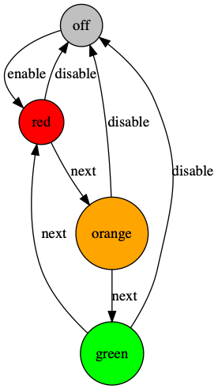

# Javascript Finite State Machine
Finite State Machines (FSMs) with modular state persistence. 

It can also generate cool pictures of your state machines. Like this `-------->`


- **Where do you want to store state of your state machines?** Memory? Redis? Mongo? 
Elsewhere? Wherever you like!

- **How do you want to manage and identify your state machines?** Single key? 
Multiple keys? Ordered set? However you like.

The usage of this module is straightforward:
1. specify your machine model,
2. pick preferred storage for your machines (memory, mongo, redis),
3. create new or load pre-existing machine instance ,
4. perform transitions and have the state automatically updated in the storage.

The state machine can work with any data layer and this module comes with batteries 
included. 3 storage implementations are included in the module
- memory
- redis
- mongodb

Each of these identifies machines by single id value. However, it's easy to implement storage
strategy which would identify machines differently.

---

# Installation
Note the version `2.0.0-rc.X` is not yet 100% stable and a few breaking changes are possible.  
```
npm install @patrikstas/finite-state-machine
```
or 
```
yarn add @patrikstas/finite-state-machine
```

# Tutorial
Clone the repo and run the demo
```bash
git clone https://github.com/Patrik-Stas/js-finite-state-machine.git
cd  js-finite-state-machine
npm install
npm run demo
```

## Defining state machine
First we need to specify our state machine. Our state machines are defined by:
- initial state
- states
- transitions 

Example:
```javascript
const semaphoreDefinition = {
  type: 'semaphore',
  initialState: 'off',
  states: {
    off:    { metadata: { 'can-pass': false } },
    red:    { metadata: { 'can-pass': false } },
    orange: { metadata: { 'can-pass': false } },
    green:  { metadata: { 'can-pass': true } }
  },
  transitions: {
    next: [
      { from: 'red',    to: 'orange' },
      { from: 'orange', to: 'green' },
      { from: 'green',  to: 'red' }],
    disable: [
      { from: 'red',    to: 'off' },
      { from: 'orange', to: 'off' },
      { from: 'green',  to: 'off' }
    ],
    enable: [
      { from: 'off',    to: 'red' }
    ]
  }
}
```
See in code at [docs/semaphore.js](docs/semaphore.js)

## Creating / Loading state machines
In general you are supposed to create and load FSM(s) (Finite State Machine(s)) using `FSM Manager`. It 
encompasses common logic and check for such operations. It expects to be supplied `Storage strategy`.
Storage strategy is a module which implements CRUD operations against particular storage technology.
The library comes by default with 3 implementations (in-memory storage, mongodb, redis).
However this might not fit your need so feel free to implement your own!

Okay, let's first create some in-memory state machine. We'll first create in-memory strategy and then 
use it to instantiate FSM Manager.

```javascript
const { semaphoreDefinition } = require('./semaphore')
const { createStrategyMemory, createFsmManager } = require('../src')

async function runExample () {
  let strategyMemory = createStrategyMemory()
  const fsmManager = createFsmManager(strategyMemory, semaphoreDefinition)
  const semaphore = await fsmManager.machineCreate('id-1')
  console.log(`Semaphore1 is in state ${await semaphore.getState()}.`)
}
runExample()
```
Executable at [docs/step1-creating.js](docs/step1-creating.js)

As you can see, you need 2 pieces to create FSM Manager:
1. Storage strategy (how and where are machines data serialized/deserialized)
2. FSM Definition (what does the FSM Model looks like)

## Transitioning the Finite State machines
Now that we have FSM Manager, let's create some machine.
The machine will only perform a transitions as far as it's valid transition according to current machine
state and machine definition.
```javascript
const { semaphoreDefinition } = require('./semaphore')
const { createStrategyMemory, createFsmManager } = require('../src')

async function runExample () {
  let strategyMemory = createStrategyMemory()
  const fsmManager = createFsmManager(strategyMemory, semaphoreDefinition)
  const semaphore = await fsmManager.machineCreate('id-1')
  console.log(`Semaphore1 is in state ${await semaphore.getState()}.`)

  // function doTransition(transitionName) invokes transitions. If the transition
  // is valid according to provided FSM definition, machine changes its state.
  await semaphore.doTransition('enable')
  console.log(`Semaphore1 is in state ${await semaphore.getState()}.`)
}
runExample()

```
Executable at [docs/step2-transitioning.js](docs/step2-transitioning.js)

The code prints
```
Semaphore1 is in state off.
Semaphore1 is in state red.
```
When we call `machineCreate`, the machine with given ID is persisted in the storage, starting in state 
specified by `initialState` from the machine definition. The function returns us an object which is 
used to further access and manipulate this particular machine representation in the storage.

When we call `doTransition`, current state is loaded from storage, checks are performed whether requested
transition is possible (according to supplied machine definition). If yes, updated state is persisted in storage.

# Reloading 
As FSM Manager handles machine persistence, you can create machine, 
do some transitions  and forget about. Then later ask FSM Manager for 
the machine with the same ID and you have it back! 
```javascript
const { semaphoreDefinition } = require('./semaphore')
const { createStrategyMemory, createFsmManager } = require('../src')

async function runExample () {
  let strategyMemory = createStrategyMemory()
  const fsmManager = createFsmManager(strategyMemory, semaphoreDefinition)
  let semaphore = await fsmManager.machineCreate('id-1')
  console.log(`Semaphore1 is in state ${await semaphore.getState()}.`)

  await semaphore.doTransition('enable')
  sema1state = await semaphore.getState()
  console.log(`Semaphore1 is in state ${sema1state}.`)
  // let's forget about our semaphore instance for now
  delete semaphore

  // just to find it later again!
  const semaphoreReloaded = await fsmManager.machineLoad('id-1')
  sema1state = await semaphoreReloaded.getState()
  console.log(`Reloaded Semaphore1 is in state ${sema1state}.`)
}
runExample()
```
Executable at [docs/step3-reloading.js](docs/step3-reloading.js)

The code prints
```
Semaphore1 is in state red.
Reloaded Semaphore1 is in state red.
```
 
# History
```javascript
const { semaphoreDefinition } = require('./semaphore')
const { createStrategyMemory, createFsmManager } = require('../src')

async function runExample () {
  let strategyMemory = createStrategyMemory()
  const fsmManager = createFsmManager(strategyMemory, semaphoreDefinition)
  const semaphore = await fsmManager.machineCreate('id-1')
  console.log(await semaphore.getState())
  await semaphore.doTransition('enable')
  await semaphore.doTransition('next')
  const semaphoreReloaded = await fsmManager.machineLoad('id-1')
  const history = await semaphoreReloaded.getHistory()
  console.log(`Current history of Semaphore id-1 is: ${JSON.stringify(history, null, 2)}`)
  // Current history of Semaphore1 is: [
  //   {
  //     "state": "off",
  //     "transition": "enable"
  //   },
  //   {
  //     "state": "red",
  //     "transition": "next"
  //   }
}
runExample()
```
Executable at [docs/step4-history.js](docs/step4-history.js)

# Different storage strategies
The whole thing becomes more useful once we start to use persistent storage implementations!
The module comes with 3 reference implementations of storage layer - memory, MongoDB and Redis.
We've previously used in-memory storage for case of simplicity. Let's try Mongo and Redis.

#### Mongo storage
```javascript
const { createStrategyMongo } = require('../src')
const { semaphoreDefinition } = require('./semaphore')
const { createFsmManager } = require('../src')
const util = require('util')
const MongoClient = require('mongodb')

async function runExample () {
  const MONGO_URL = process.env.MONGO_URL || 'mongodb://localhost:27017'
  const asyncMongoConnect = util.promisify(MongoClient.connect)
  const mongoHost = await asyncMongoConnect(MONGO_URL)
  const mongoDatabase = await mongoHost.db(`FSM-DEMO`)
  const collection = await mongoDatabase.collection(`FSM-DEMO-${Date.now()}`)

  // and we can use it exactly like we did previously
  const strategy = createStrategyMongo(collection)
  const fsmManager = createFsmManager(strategy, semaphoreDefinition)
  let semaphore = await fsmManager.machineCreate('id1')
  await semaphore.doTransition('enable')
  console.log(`Semaphore is in state ${await semaphore.getState()}.`)
}
runExample()
```
Executable at [docs/step5a-mongo-storage.js](docs/step5a-mongo-storage.js)

The code prints
```
Semaphore1 is in state red.
```

#### Redis storage
```javascript
const { createStrategyRedis } = require('../src')
const { semaphoreDefinition } = require('./semaphore')
const { createFsmManager } = require('../src')
const redis = require('redis')

async function runExample () {
  const REDIS_URL = process.env.REDIS_URL || 'redis://localhost:6379'
  const redisClient = redis.createClient(REDIS_URL)

  // and we can use it exactly like we did previously
  const strategy = createStrategyRedis(redisClient, 'fsm-demo')
  const fsmManager = createFsmManager(strategy, semaphoreDefinition)
  let semaphore = await fsmManager.machineCreate('id1')
  await semaphore.doTransition('enable')
  console.log(`Semaphore is in state ${await semaphore.getState()}.`)
}
runExample()
```
Executable at [docs/step5b-redis-storage.js](docs/step5b-redis-storage.js)

The code prints
```
Semaphore1 is in state red.
```

# Dotify FSM Definition
TODO: Example for creating `.dot` file and rendering as image.

## Tweaking storage for your needs
All provided storage implementations share the same interface, but it's very likely you will have just
a slightly different needs. Maybe you want to organize the data in database in a different way, or maybe
you want to identify each machine by 2 keys, instead of only single id.

In that case I encourage you to look into `src/core/fsm-storage` reference implementations and use them
as starters for your implementations. 

## Digging deeper
Please take look at `test/core/fsm-identified-by-id.spec.js` to see more examples for deeper understanding
of this FSM implementation.


#### Todos
- add package.json commands to run tutorial steps
- add bin command to package generate and render dotfiles
- add examples for fsm manager and querying multiple machines
- note in tutorial that state machine also keep utime of creation and last update
